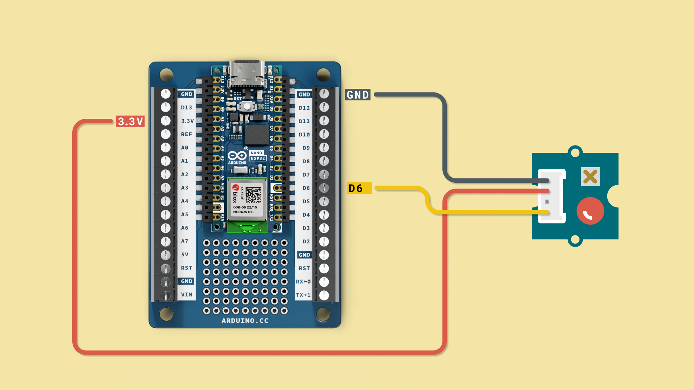

In this chapter, we will work with digital signals through practical examples, working with some electronic components and MicroPython code modules.

You will learn the following in this chapter:
- How to read a button,
- how to turn on an LED,
- how to make the Nano ESP32 perform a continuous action (placing it in a loop).

## Digital Signals

A digital signal has only two states: a **HIGH** or a **LOW** state. They can for example be used to read the state of a button (pressed/not pressed), or turn on an LED (on/off).

So how does digital signals work? Well, it is quite simple! In the case of the button, the Arduino can be programmed to check whether **current** is flowing through, and if it is, we will read a HIGH state, or a **"1"**. If it is not, we will read a LOW state, or a **"0"**.

For the LED, we can do sort of the reverse: we can write a HIGH / LOW state to it. If we connect the LED to a **digital pin** on the Arduino, we can therefore turn it on or off, by writing a **"1"** or **"0"** to it.

<video width="100%" loop autoplay>
<source src="assets/button+led.mp4" type="video/mp4" />
</video>

## Exercise 1: Read a Button

In this exercise, we will read a button, which we will need to connect to our Nano ESP32 board, following the circuit diagram below:


When placing the Nano ESP32 onto the Nano Screw Terminal Adapter, pay attention to the drawing on the adapter, and line up your board with it, so that the boards USB-C® port lines up with the drawing. 

Screw terminals are a great way of connecting components quickly and sturdily. Grab yourself a screwdriver of an appropriate size, then feed the wire that you want to connect to a pin through the hole on the side of the adapters screw terminal, and screw down the corresponding screw to tighten its grip on the wire. 

Once the cable is stuck in there, you've made a solid connection!

Open the code editor, and copy paste the following script to the `main.py` file, then click on the **"Run"** button to run it.

```python
from machine import Pin
import time

button = Pin(9, Pin.IN, Pin.PULL_UP)

while True:
    print(button.value())
    time.sleep(0.5)
    if button.value() == 1:
        print("BUTTON PRESSED!")
```

***Please note that the pin number reflects the GPIO on the ESP32-S3, not the Nano board. In the circuit, we are connecting the button to pin `D6`, but in the code, we use pin `9`. You can read more about this and see the full pin map [here](/micropython-course/course/introduction-python#nano-esp32--micropython-pinout).***

Then, click on the **Run"** button to run the script. Now, if we click the button, we should see a message in the terminal: **"BUTTON PRESSED!"**.

.

We have now successfully read the state of a button, one of the world's most commonly used circuits!

## Exercise 2: Turn on an LED

In the next exercise, we will turn on an LED, which we will need to connect to our Nano ESP32 board, following the circuit diagram below:



Open the code editor, and copy paste the following script to the `main.py` file, then click on the **"Run"** button to run it.

```python
from machine import Pin
import time

myLED = Pin(9, Pin.OUT)

while True:
    myLED.value(0)
    time.sleep(1)
    myLED.value(1)
    time.sleep(1)
```

When we launch the script, we should see the LED flashing. This is because we added the `time.sleep(1)` command to the script. Whenever this line is executed, the Nano ESP32 pauses for a second, before resuming its tasks.

<video width="100%" loop autoplay>
<source src="assets/led.mp4" type="video/mp4" />
</video>


Note that we also used a `while True:` statement, which puts the Nano ESP32 into a loop mode, continuing forever and ever (or until you pause the script).

## Summary

Digital signals are characterized by two states: a HIGH state and a LOW state. They are commonly used to determine the state of a button (pressed or not pressed) and control the on/off state of an LED. They can also be used for many, many more applications and are a fundamental part of any electronic design.

These exercises provide hands-on experience with digital signals, enabling the reader to understand how to read input from a button and control output to an LED using the Nano ESP32 board.

- [Next Chapter: Analog I/O & PWM Signals](/micropython-course/course/analog)