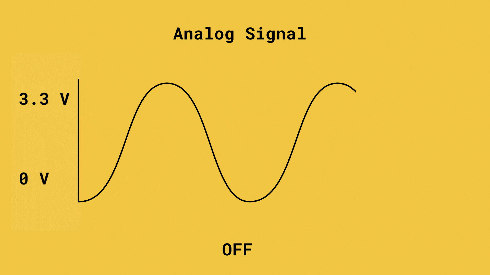
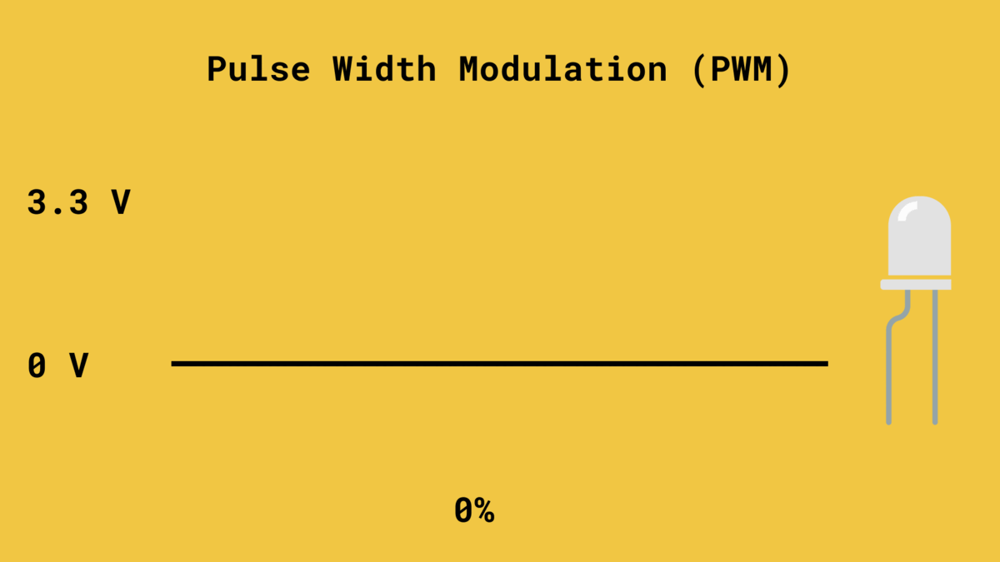
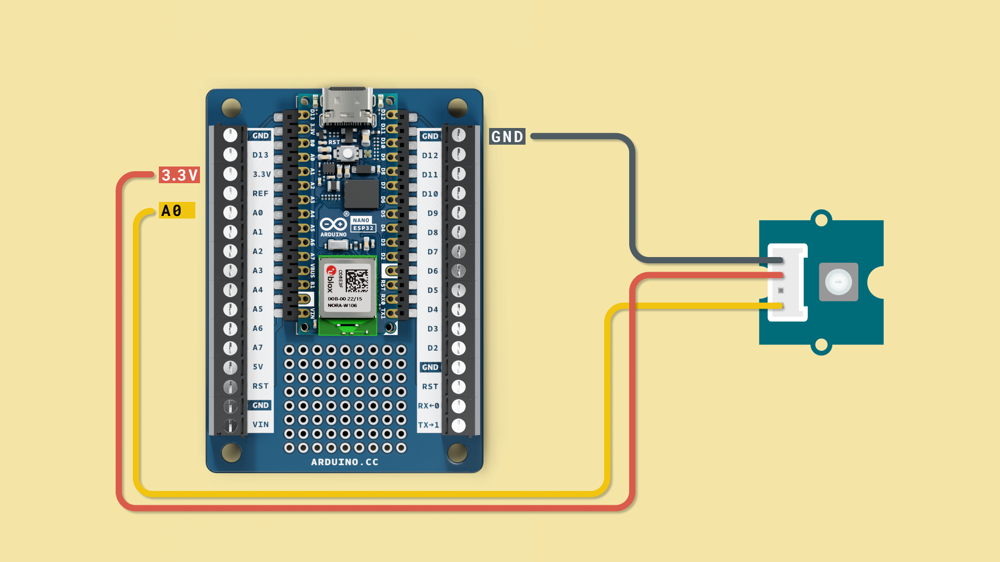
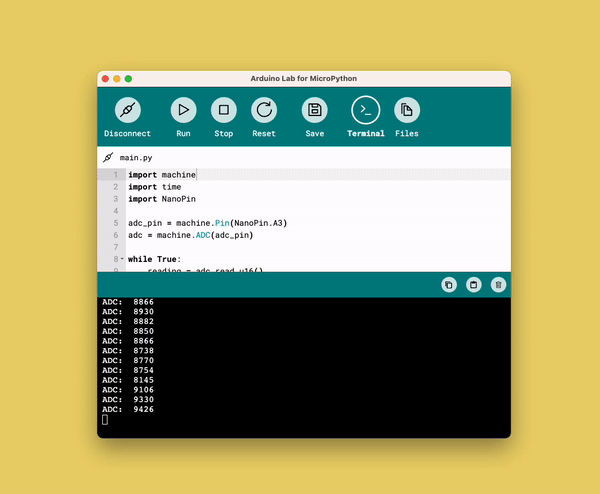

In this chapter, we will explore how to read analog signals using an **Analog-to-digital converter (ADC)**, and how to write them, using a technique called **pulse width modulation (PWM)**. 

Analog signals are used to represent phenomena in the real world, such as pressure, temperature or other physical quantities. Analog signals differ from digital ones as they can have an **infinite** number of possible values, whereas digital ones are **finite**. 

You will learn the following in this chapter:
- How to read an analog signal,
- how to generate a faux analog output signal using PWM, to fade an LED.

## Analog Signals

An analog signal is a continuous signal that represents information as a varying quantity or property. Unlike digital signals that have discrete states, analog signals can have an infinite number of possible values within a given range.

They are used to represent the physical properties, such as audio, light, temperature and so on. To measure these properties, we can use **sensors**, which convert these properties into a voltage that can be measured with an Arduino! 



An **ADC** on the Arduino converts the analog signal to a digital signal, which makes it possible for us humans to understand the signal.

The value we can read from an analog signal is within a fixed range. In this course, we are working with a range between **0-65 355 (16-bit)** which represents **0-5 V**. So, if we are reading 33 000, it means the signal is at around **2.5 V**.

## Pulse Width Modulation (PWM)

PWM is a technique that is used to write a specific voltage to a pin. This is very useful when you want to either control the speed of a motor, or adjust the brightness of an LED.

So how does that work? Essentially, PWM is a digital signal that is rapidly switching on and off, mimicking an analog signal (a waveform). We can then adjust the **duty cycle**, which is the fraction of a period where a signal is active. 

Simply explained, if we have a 50% duty cycle, we are working at half capacity.  



***A PWM signal is actually a digital signal that is switched on and off so fast that it produces an analog like signal.*** 

## Exercise 1: Read an Analog Signal

In this exercise, we will read an analog signal through a **potentiometer**. A potentiometer is a simple knob that increases or decreases the internal resistance, which adjusts the voltage we read via the Arduino. 

To connect the potentiometer to the Nano ESP32 board, follow the circuit diagram below:



Open the code editor, and copy paste the following script to the `main.py` file, then click on the **"Run"** button to run it.

```python
import machine
import time

adc_pin = machine.Pin(1) # This is the A0 pin on the Arduino
adc = machine.ADC(adc_pin)

while True:
    reading = adc.read_u16()     
    print("Analog Value: ",reading)
    time.sleep_ms(500)
```

Now if we turn the knob on the potentiometer, we should see the value increase or decrease in the terminal.

.

We have now successfully read the value of an analog signal!

## Exercise 2: Dimmer

In the next exercise, we will add an LED to our circuit, which we will control with the potentiometer from the previous exercise.

Follow the circuit diagram below to add the LED to the circuit.


Open the code editor, and copy paste the following script to the `main.py` file, then click on the **Run"** button to run it.

```python
import machine
import time

from machine import Pin, PWM, ADC

adc_pin = machine.Pin(1)
adc = machine.ADC(adc_pin)

pwm = PWM(Pin(9))
pwm.freq(1000)


while True:
    raw = adc.read_u16()  
    pwm.duty_u16(raw)
    time.sleep_ms(20)
```

Now, turn the knob, and watch as the LED dims according to the knob's position.

<video width="100%" loop autoplay>
<source src="assets/pot+led.mp4" type="video/mp4" />
</video>


You've now created a dimmer, something you will find in most modern homes!

## Summary

These exercises provides an understanding of how to read analog signals and utilize PWM to control output devices such as LEDs. 

The concepts covered in this chapter are fundamental in working with analog signals and can be applied in various projects and applications.

- [Next Chapter: Serial Protocols](/micropython-course/course/serial)

