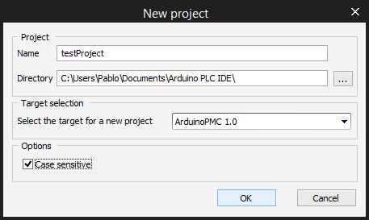
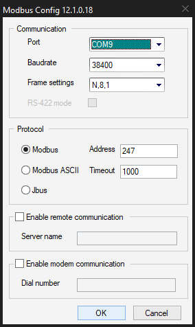
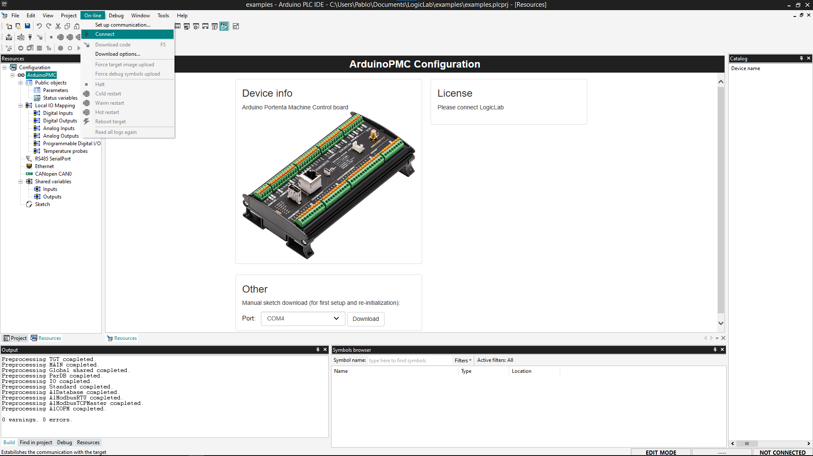
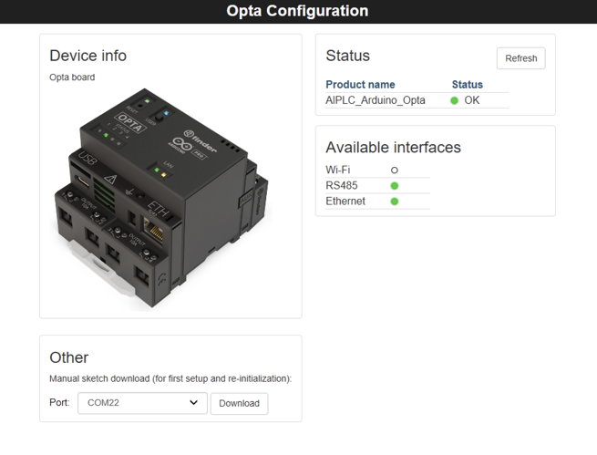
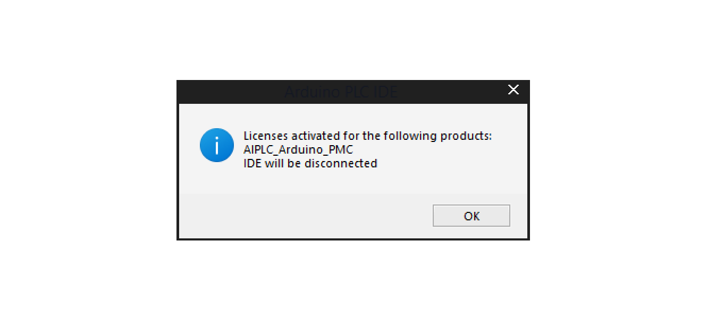

## Overview

The **Arduino PLC IDE** offers the possibility to use **IEC IEC61131-3** programming languages (LD, SFC, FBD, ST, IL) with the **Portenta Machine Control and Opta™**. The PLC IDE offers a wide set of standard features commonly used in industrial automation.

This tutorial will show you how to connect the Portenta Machine Control and Opta™ to the Arduino PLC IDE, learning how to activate the software license and the basic setup to have your board up and running with the **Arduino PLC IDE**.

## Goals

- Install the Arduino PLC IDE and the Arduino PLC IDE Tools
- Download the PLC IDE bootloader to the board
- Connect the computer to your device through the IDE
- Activate the device license
- Test the connection

## Required Hardware and Software

- Board compatible with the Arduino PLC IDE (Portenta Machine Control or Opta™).
- Arduino PLC IDE ([Official Website](https://www.arduino.cc/pro/software-plc-ide)).
- If you have a Portenta Machine Control, you will need a unique PLC IDE License key for your device. Get your license key [here](https://store.arduino.cc/products/plc-key-portenta-machine-control).
- If you have an Opta™, you do not need any license key to activate your product. Go to section __License Activation With Pre-Licensed Products (Opta™)__ to know more.
- [Arduino IDE 1.8.10+](https://www.arduino.cc/en/software), [Arduino IDE 2](https://www.arduino.cc/en/software), [Arduino Web Editor](https://create.arduino.cc/editor) or any program with a serial monitor in case you need to retrieve the _Hardware-ID_ of your device.

***To get the Arduino PLC IDE and the PLC IDE License for your device, please visit the [Arduino software page](https://www.arduino.cc/en/software) and the [store page](https://store.arduino.cc/plc-key-portenta-machine-control).***

## Instructions

To get the Arduino PLC IDE software, go to the [official software website of the Arduino PLC IDE](https://www.arduino.cc/pro/software-plc-ide) and choose to download the PLC IDE software files. You will need two following executables:

* Arduino PLC IDE Tools
* Arduino PLC IDE

The software requires **Windows 10** or a newer operating system version for the x64 architecture.

The first executable file packages all the required drivers, libraries, and cores that you will need. The second executable will install the IDE software. The continuing sections will help you install the Arduino PLC IDE software properly.

### 1. Arduino PLC IDE Tools Setup

For a proper Arduino PLC IDE setup, you will need to install all the required tools before IDE software setup.

When you download the Arduino PLC IDE Tools executable, the file naming scheme is as follows:

`Arduino-PLC-IDE-Tools_X.X.X_Windows_64bit`

If you have got the correct tool package, it should follow the previous naming scheme with the `X.X.X` that represents the version of the tool package. Once you have verified and downloaded the Arduino PLC IDE Tools executable, run the installer and follow the installation instructions.

Once the installation has finished, all the required drivers, libraries, and Arduino cores will be installed and ready to be used. Your computer is now ready to install the Arduino PLC IDE.

***It is possible that during the installation, some terminal windows will pop by the installation program. Do not worry about it, these windows are required by the program to install all the tools that your computer needs.***

### 2. Arduino PLC IDE Setup

When you download the Arduino PLC IDE executable, the file naming scheme is as follows:

`Setup_Arduino PLC IDE_X.X.X.X_{ReleaseDate}`

If you have the correct IDE software, its name should include the version format `X.X.X.X`, with the associated release date in the `{ReleaseDate}` field. For instance, a release date might look like `20230329`.

Run the Arduino PLC IDE installer after you have installed the Arduino PLC IDE Tools. If you have not installed the PLC IDE tools, please check [Arduino® PLC IDE Tools Setup section](#1-arduino-plc-ide-tools-setup) before proceeding as it needs to have the tools set before IDE software installation.

Follow the installation instructions and finish the IDE setup process.

***If you have any problem, try rebooting your computer to ensure that all the drivers, libraries, and dependencies are applied and up to date.***

Once the setup is complete, open the Arduino PLC IDE program, and the welcome screen will greet you.

The following sections will guide you to create a project, download the runtime, and properly interface the Portenta Machine Control or Opta™ with its dedicated license activation procedure.

### 3. Project Setup

Create a new project by clicking the middle **New project ...** button or **File > New Project**

After creating the project, there are some new windows on the screen, click on the left panel and switch it to the **Resources tab**, inside the window on the tree structure. Now click on your board and it will open the **Boards configuration page**.

### 4. Download the Runtime

The board needs to run a specific program (runtime) in order to interact with the **PLC IDE**. Go to the **"Other"** section below the **"Device Info"** block.

Plug your device to the computer, select the Serial Port of your board and click the **Download** button.

***The device will show up two Serial Ports, the default one (generally with the lowest number) is the usual Serial Port, the secondary one (usually with the highest number) is a virtual port for Modbus communication from the device to your computer. Take note of the port number assigned to the secondary port (virtual port for Modbus) as it will be needed in a second step.***

If during the download procedure the following message appears, double-tap the reset button using the tip of a pen or a similar pointed object. The LED above the reset button will start blinking indicating that the Opta™ is ready to be flashed with a new firmware. Click the **Download** button to start the process again.

### 5. Connect to the Device

After the runtime is up and running, set up the communication by going to **On-line > Set up communication**.

On the new pop-up window open the properties of the Modbus protocol.

Make sure the Modbus protocol is using the secondary Serial port number, the Modbus Virtual port you took note of before.  Press OK.

Click OK to save the settings and press the connect button on **On-line > Connect**.

### 6. License Activation with Product Key (Portenta Machine Control)

If the communication is successful the main panel will show the license section to be filled in and a status indicator.

#### Online Activation
  

To use your product license, paste the key in the blank next to **Product Key** and press the **Activate** button.

After you click the **Activate** button, the IDE will bind the license to the hardware ID. A popup telling you to reboot the target (which is the device connected to the PLC IDE) will show up; press the reset button of your device to reboot.

Once the product has been activated, it is recommended to get the **Hardware-ID** of your device.

#### Offline Activation
  

To activate the product **Offline**, deselect the "Online" slider and the scenario below will show up:

Follow the instructions provided using our Contact [form](https://www.arduino.cc/en/contact-us) and generate the **Activation Request File**.

Once you receive the **Activation file**, drag and drop the file in the dashed rectangle or select it from the folder where it is stored to complete your Offline Activation.

### 7. License Activation with Pre-Licensed Products (Opta™)

When a product is **Pre-licensed**, the following scenario will be displayed:

By clicking the **Activate PLC Runtime** button, the product activation will be completed and the PLC **Status** will be set as OK:

Now the product is ready to be used with the PLC IDE.

### 8. Activation Recovery

In case the hardware is being reflashed and the key got lost, the license can be recovered just by clicking the "**Forgot your Product Key?**" button:

The IDE will then connect to a server, validate the hardware and recover the activation, showing a confirmation pop-up when done:

### 9. Getting the Hardware-ID of Your Device

To do it follow the next steps:

- Be sure that your device is disconnected from the Arduino PLC IDE
- Open the **Arduino IDE** software
- Go to **Tools** > **Board** > **Arduino Mbed OS Portenta Boards** > **Arduino Portenta H7 (M7 Core)**
- Go to **Tools** > **Port** to select the proper port (the default one shown before in the PLC IDE inside the **Arduino PMC Configuration** > **Other** section)
- Go to **Tools** > **Serial Monitor** and reset the board. Look at the end of the boot report to find the "Hardware-ID" and store it in a safe place.

### 10. Download a Program

Let's download and run the first program on your device. We are going to use the default program that is included in a project: a counter.

Double-click on the file _main_ inside the _Project_ to see the counter program. To download that program to your PLC, it is needed to compile the program and send it to the target device.

### 11. Communication Test

Open the **Watch** window by clicking on "View > Tool Windows > Watch", it will attach a new window on the right side called **Watch**. This window shows the real-time variables value.

To add a new variable to be watched you can click the **Insert new item** button inside the window, it will open a popup window, on the name label insert "cnt", and on the location "main", click OK and it will add the variable `cnt` from the `main` program on the table or drag and drop the `cnt` variable from the **Project** tree or from the **Main** program.

Select the **Watch** window and click on the **Start/Stop watch button** unless the value of the variable is already getting updated.

## Conclusions

In this tutorial, we went through how to set up the Portenta Machine Control or Opta™ with the Arduino IDE lab, learned how to connect the board to the program through Modbus, activate the hardware license of your product, and create a simple sketch with one variable that went compiled and downloaded inside the board. Finally, we learned how to see the values of the variables in real-time using the **Watch** window.

Now that your board is up and running with the Arduino PLC IDE, you can start to create your own professional solutions.